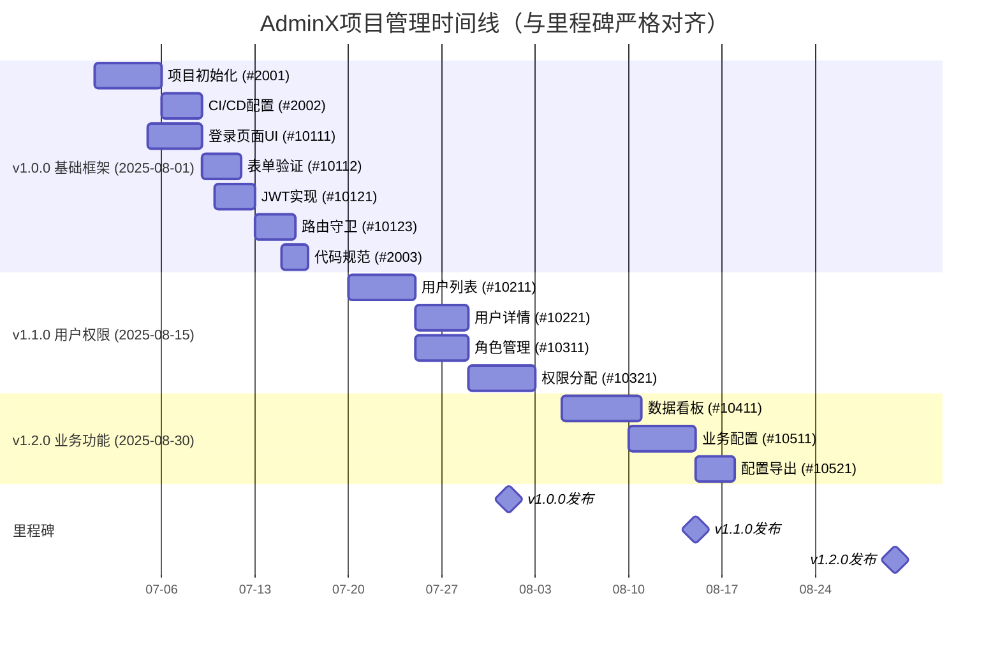

# 🚀 GitHub 协作开发流程指南

## 📚 相关文档

- [GitHub Issues 文档](https://docs.github.com/en/issues)
- [GitHub Projects 文档](https://docs.github.com/en/issues/planning-and-tracking-with-projects)
- [GitHub Milestones 文档](https://docs.github.com/en/issues/using-labels-and-milestones-to-track-work/about-milestones)
- [语义化版本规范](docs/语义化版本.md)
- [GitHub 角色与职责](docs/workflow/github-roles.md)
- [代码贡献指南](CONTRIBUTING.md)

## 🔍 1. 问题发现与 Issue 创建

### 示例：创建 React18+Antd 中后台系统

```markdown
### 需求：开发企业级中后台管理系统

**项目代号**：AdminX  
**背景**：XX 公司现有后台系统老旧，需要重构为现代化管理系统  
**技术栈**：React18 + Ant Design Pro + TypeScript + Vite  
**核心模块**：

1. 认证中心（登录/权限）
2. 用户管理中心
3. 角色权限系统
4. 数据统计看板
5. 业务配置中心

### 主 Issue 示例 (#100)

**标题**: [Project] 开发 AdminX 后台管理系统  
**内容**:

- 目标：替换旧系统，提供现代化管理界面
- 功能范围：见上述核心模块
- 技术要求：
  - 响应式布局
  - 支持多主题切换
  - 完善的权限控制
- 里程碑计划：
  - v1.0.0 (2025-08-01): 基础框架+认证中心
  - v1.1.0 (2025-08-15): 用户管理+权限系统
  - v1.2.0 (2025-08-30): 数据看板+业务配置
```

1. 发现问题或新需求时，在 GitHub 仓库创建 Issue
2. Issue 标题应清晰描述问题/需求，例如：
   - `[Feature] 开发用户管理模块`
   - `[Bug] 登录页面验证码不显示`
3. Issue 内容应包含：
   - 问题描述（如果是 bug）
   - 需求背景和目标（如果是新功能）
   - 预期行为
   - 复现步骤（如果是 bug）
   - 相关截图或日志（如有）

## 🧩 2. Issue 拆解与子任务

1. 对于复杂 Issue，拆分为多个子 Issue：
   - 每个子 Issue 应聚焦单一任务，例如：
     - `[Feature] 实现用户列表查询功能`
     - `[Feature] 开发角色权限分配界面`
   - 在父 Issue 中列出所有子 Issue 链接
   - 使用`#`引用相关 Issue（如`#123`）

### 示例：中后台系统功能拆解（按里程碑对齐）

```mermaid
graph TD
    %% v1.0.0 基础框架
    A[AdminX系统 #100] --> B[认证中心 #101]
    B --> B1[登录页面 #1011]
    B1 --> B11[UI组件开发 #10111]
    B1 --> B12[表单验证 #10112]
    B1 --> B13[验证码集成 #10113]
    B --> B2[JWT验证 #1012]
    B2 --> B21[Token生成 #10121]
    B2 --> B22[Token验证 #10122]
    B2 --> B23[路由守卫 #10123]
    A --> SCAFFOLD[脚手架 #200]
    SCAFFOLD --> S1[项目初始化 #2001]
    SCAFFOLD --> S2[CI/CD配置 #2002]
    SCAFFOLD --> S3[代码规范 #2003]

    %% v1.1.0 用户权限
    A --> C[用户管理 #102]
    C --> C1[用户列表 #1021]
    C1 --> C11[表格组件 #10211]
    C1 --> C12[分页逻辑 #10212]
    C1 --> C13[搜索功能 #10213]
    C --> C2[用户详情 #1022]
    C2 --> C21[详情页UI #10221]
    C2 --> C22[编辑功能 #10222]
    A --> D[权限系统 #103]
    D --> D1[角色管理 #1031]
    D1 --> D11[角色列表 #10311]
    D1 --> D12[角色CRUD #10312]
    D --> D2[权限分配 #1032]
    D2 --> D21[权限树 #10321]
    D2 --> D22[分配逻辑 #10322]

    %% v1.2.0 业务功能
    A --> E[数据看板 #104]
    E --> E1[数据概览 #1041]
    E1 --> E11[图表组件 #10411]
    E1 --> E12[数据接口 #10412]
    A --> F[业务配置 #105]
    F --> F1[配置管理 #1051]
    F1 --> F11[配置表单 #10511]
    F1 --> F12[配置存储 #10512]
```



### **里程碑对齐的子 Issue 示例**:

#### v1.0.0 基础框架

- #10111 [Feature] 登录页面 UI 组件开发
  - 使用 Antd ProComponents 搭建登录表单
  - 实现响应式布局
  - 添加公司 Logo 和主题色
- #10121 [Feature] JWT Token 生成
  - 集成 jsonwebtoken 库
  - 实现 Token 生成接口
  - 设置 Token 过期时间

#### v1.1.0 用户权限

- #10211 [Feature] 用户列表表格组件
  - 使用 ProTable 实现
  - 支持列排序
  - 实现行选择功能
- #10321 [Feature] 权限树形组件
  - 递归渲染菜单树
  - 实现全选/半选状态
  - 支持懒加载

#### v1.2.0 业务功能

- #10411 [Feature] 数据看板图表组件
  - 集成 ECharts
  - 实现柱状图/折线图
  - 添加图表响应式
- #10511 [Feature] 业务配置表单
  - 动态表单生成
  - 表单验证规则
  - 配置项分组展示

## 🗓️ 3. 里程碑规划

1. 创建里程碑(Milestone)：
   - 命名规范：`vX.Y.Z`（遵循语义化版本）
   - 设置合理的截止日期（建议 2-4 周一个迭代）
   - 将相关 Issue 分配到里程碑
   - 每个里程碑应有明确的目标和验收标准

### AdminX 项目里程碑示例（详细对齐）

```markdown
### 里程碑 v1.0.0 (基础框架) - 2025-08-01

#### 认证中心

- #10111 登录页面 UI 组件开发
- #10112 表单验证逻辑
- #10113 图形验证码集成
- #10121 JWT Token 生成
- #10122 Token 验证中间件
- #10123 路由守卫实现

#### 项目脚手架

- #2001 Vite+React18 初始化
- #2002 GitHub Actions CI 配置
- #2003 ESLint+Prettier 规范

### 里程碑 v1.1.0 (用户权限) - 2025-08-15

#### 用户管理

- #10211 用户列表 ProTable 实现
- #10212 分页查询逻辑
- #10213 复合搜索功能
- #10221 用户详情页开发
- #10222 用户信息编辑

#### 权限系统

- #10311 角色列表 CRUD
- #10321 权限树形组件
- #10322 角色-权限关联

### 里程碑 v1.2.0 (业务功能) - 2025-08-30

#### 数据看板

- #10411 ECharts 集成
- #10412 数据接口联调
- #10413 图表响应式适配

#### 业务配置

- #10511 动态表单生成器
- #10512 配置存储方案
- #10521 配置导入导出
```

## 📊 4. 使用 Projects 功能（详细时间线示例）

### 项目启动日 (2025-07-07)

1. 创建 Project 看板"AdminX 管理系统开发"
2. 设置看板列：
   - `Backlog`：需求池
   - `To Do`：准备开发
   - `In Progress`：开发中
   - `In Review`：代码审查
   - `Done`：已完成
3. 添加所有里程碑 Issue 到看板



### 开发阶段 (2025-07-08 至 2025-07-12)

- 将#10111、#10112、#10113 移动到`In Progress`
- 每日站会更新任务状态
- 完成#10111 后：
  1. 创建 PR 并关联 Issue
  2. 移动 Issue 到`In Review`
  3. 通过审查后合并代码
  4. 移动 Issue 到`Done`

### 里程碑交付 (2025-08-01)

1. 确认所有 v1.0.0 Issue 处于`Done`列
2. 创建 release 分支
3. 生成 CHANGELOG
4. 归档已完成的 Issue

### 看板管理技巧

1. 使用 Label 区分模块（如`auth`, `user`）
2. 设置自动化的 PR→Issue 状态联动
3. 每周同步看板状态与里程碑进度
4. 使用 Filter 快速查看各模块进展

## 💻 5. 开发流程

1. 创建开发分支：

   ```bash
   git checkout -b feat/123-user-management
   ```

   - 分支命名：`类型/issue编号-简短描述`
   - 类型前缀：`feat/`(功能)、`fix/`(修复)、`docs/`(文档)等
   - 示例分支：
     - `feat/145-user-list` (用户列表功能)
     - `fix/203-login-bug` (登录问题修复)
     - `docs/300-update-readme` (文档更新)

2. 开发规范：

   - React 组件使用 PascalCase 命名
   - 页面组件放在`src/pages`目录
   - 公共组件放在`src/components`目录
   - 使用 Antd ProLayout 搭建基础框架

3. 开发完成后提交 PR：

   - 从开发分支向`main`分支提 PR
   - PR 标题格式：`类型: 简短描述 (#Issue编号)`
   - PR 描述应包含：
     - 变更内容
     - 相关 Issue 链接
     - 测试说明
     - 截图（如有 UI 变更）

4. Code Review：

   - 至少需要 1 个核心成员批准
   - 解决所有评论后才能合并

5. 合并 PR 并关闭 Issue：
   - 使用`Squash and merge`方式合并
   - 在合并信息中引用 Issue（如`Closes #123`）

## 🎯 6. 版本发布

1. 当里程碑中所有 Issue 完成后：

   - 从`main`分支创建发布分支`release/vX.Y.Z`
   - 更新 CHANGELOG.md：
     - 按类别列出所有变更（功能、修复、优化等）
     - 每个变更项引用相关 PR/Issue
     - 对于 React 项目，同时更新 package.json 版本号

2. 创建 GitHub Release：
   - 版本号：`vX.Y.Z`
   - 标题：`版本 X.Y.Z`
   - 描述内容：
     - 主要变更摘要
     - 完整变更日志（可链接到 CHANGELOG.md）
     - 升级说明（如有不兼容变更）
   - 附加编译后的产物（如二进制文件）

### 示例：中后台系统 v1.0.0 发布

```markdown
## [1.0.0] - 2025-08-01 - 基础框架

### 新增功能

- 项目脚手架搭建 (#200)
  - React18 + TypeScript
  - Vite 构建工具
  - Ant Design Pro 模板
- 认证中心 (#101)
  - 登录页面（用户名+密码+验证码）
  - JWT 令牌验证
  - 基础路由守卫

### 变更记录

- 新增依赖：
  - antd@5.0.0
  - @ant-design/pro-components
  - react-router-dom
- 配置文件：
  - 新增 vite.config.ts
  - 添加环境变量配置
  - 设置全局主题色

### 升级说明

1. 安装依赖：
   pnpm add antd @ant-design/pro-components

2. 环境要求：

- Node.js >= 18.0.0
- React18 必须使用

3. 已知问题：

- 移动端适配待完善 (#201)
- 主题切换功能待开发 (#202)
```
